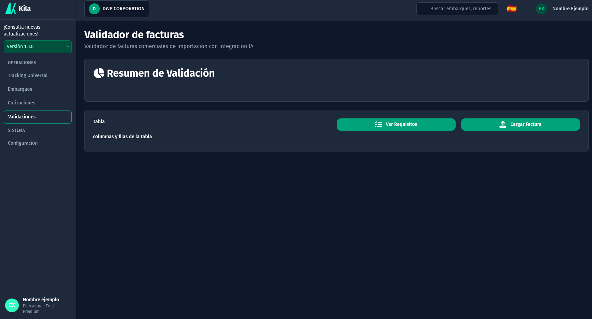
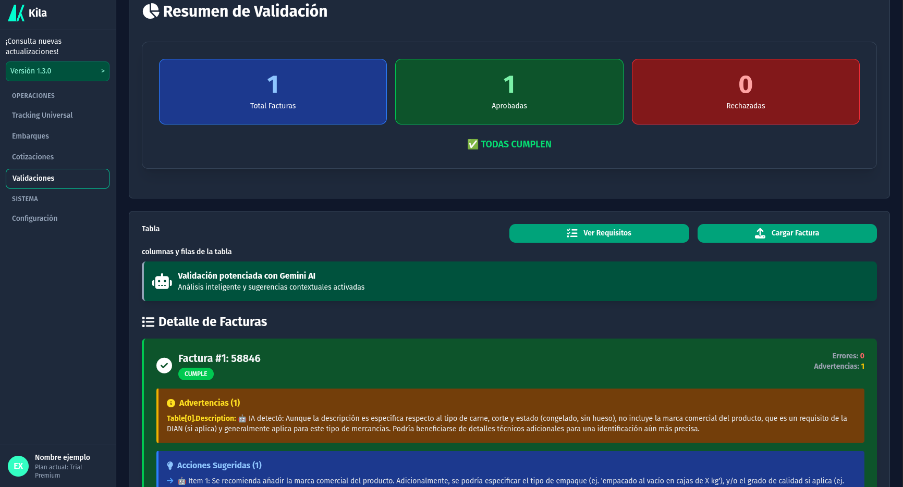
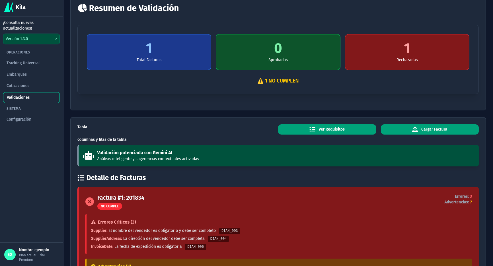
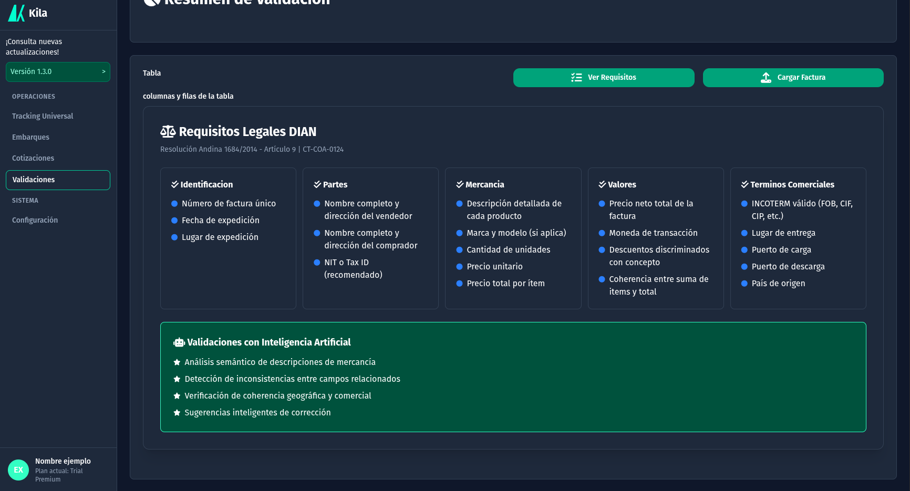

# Validador de Facturas DIAN - README

## 📋 Descripción General

**Validador de Facturas DIAN** es una aplicación web que automatiza la validación de facturas comerciales de importación según la **Cartilla CT-COA-0124 de la DIAN**. Utiliza un enfoque híbrido que combina validaciones basadas en reglas aduanales con análisis inteligente, permitiendo detectar errores estructurales e inconsistencias contextuales en documentos de comercio internacional.

### Características principales

- ✅ 11 validaciones automáticas según normativa DIAN
- 🤖 Análisis inteligente contextual (coherencia geográfica, comercial)
- 📊 Sugerencias accionables de corrección
- 🎨 Interfaz responsiva y moderna

---

## 🚀 Instalación y Configuración

### Requisitos previos

- **Python 3.10+** instalado en tu sistema
- **pip** (gestor de paquetes de Python)
- **API Key de Google Gemini** (obtenerla en [Google AI Studio](https://aistudio.google.com/app/apikeys))
- **Navegador web moderno** (Chrome, Firefox, Safari, Edge)

### Paso 1: Clonar o descargar el proyecto

```bash
# Si tienes Git
git clone <tu-repositorio>
cd validador-facturas-dian

# O descarga el archivo ZIP y extrae
cd validador-facturas-dian
```

### Paso 2: Crear entorno virtual

```bash
# En Linux/Mac/Pop!_OS
python3 -m venv venv
source venv/bin/activate

# En Windows (PowerShell)
python -m venv venv
.\venv\Scripts\activate
```

### Paso 3: Instalar dependencias

```bash
pip install -r requirements.txt
```

### Paso 4: Configurar API key

En el archivo `.env` en la carpeta `backend/`:

```bash
# .env
GEMINI_API_KEY=tu-api-key-real-aqui
```

### Paso 5: Ejecutar el servidor

```bash
# Desde la carpeta backend/
uvicorn main:app --reload

# Verás un mensaje como:
# INFO:     Uvicorn running on http://127.0.0.1:8000
```

### Paso 6: Abrir el frontend

**Opción A - Archivo local:**

- Abre el archivo `frontend/index.html` directamente en tu navegador

**Opción B - Servidor local (recomendado):**

```bash
# En otra terminal
cd frontend
python -m http.server 8080

# Luego abre: http://localhost:8080
```

---

## 📖 Cómo usar la aplicación

### 1. Ver Requisitos DIAN

- Haz clic en el botón **"Ver Requisitos DIAN"**
- Se abre una sección con todos los campos obligatorios según la Cartilla CT-COA-0124
- Haz clic de nuevo para cerrar

### 2. Cargar factura para validar

**Opción A - Una factura individual:**

1. Haz clic en **"Cargar factura"** para sleccionar el archivo JSON de tu factura
2. Espera el resultado

### 3. Interpretar resultados

**Estructura de cada resultado:**

- 🟢 **CUMPLE**: La factura cumple todos los requisitos DIAN
- 🔴 **NO CUMPLE**: Tiene errores que impiden la importación
- ⚠️ **Advertencias**: Posibles problemas pero no críticos
- 💡 **Sugerencias**: Recomendaciones para corregir
- 🤖 **Análisis IA**: Validaciones inteligentes contextuales

---

### Flujo de datos

```
Usuario carga JSON
        ↓
JavaScript fetch() → /validar-lote
        ↓
FastAPI recibe datos
        ↓
Pydantic valida estructura → FacturaComercial
        ↓
ValidadorDIAN.validar()
  ├─ 11 validaciones por reglas de la DIAN
  └─ Análisis contextual con Gemini
        ↓
JSON con resultados → Frontend
        ↓
Visualización de errores,advertencias,sugerencias
```

---

## 📊 Estructura de respuesta

La API retorna una estructura estandarizada:

```json
{
  "success": true,
  "factura_numero": "INV-2025-001234",
  "resultado": {
    "cumple": false,
    "errores": [
      {
        "campo": "Description",
        "mensaje": "Descripción demasiado corta",
        "codigo": "DIAN_008"
      }
    ],
    "advertencias": [
      {
        "campo": "coherencia_general",
        "mensaje": "🤖 IA: La moneda USD es coherente con proveedor USA"
      }
    ],
    "sugerencias": ["Incluya marca, modelo y características técnicas del item"],
    "validacion_ia": {
      "coherente": true,
      "problemas_detectados": [],
      "advertencias_ia": []
    }
  },
  "ia_utilizada": true
}
```

---

## 🖼️ Screenshots de la aplicación

### Pantalla principal



### Resultado de validación exitosa



_Factura que cumple todos los requisitos (tarjeta verde)_

### Resultado con errores y análisis IA



_Factura con errores detectados + análisis contextual de Gemini_

### Requisitos DIAN (vista expandida)



_Listado de campos obligatorios según Cartilla CT-COA-0124_

---

## 📧 Soporte

Para reportar bugs o sugerir mejoras, abre un issue en el repositorio.

---

**Versión:** 2.0.0
**Última actualización:** 15 de Noviembre de 2025
**Autor:** INVALIDOS FC
**Licencia:** --
